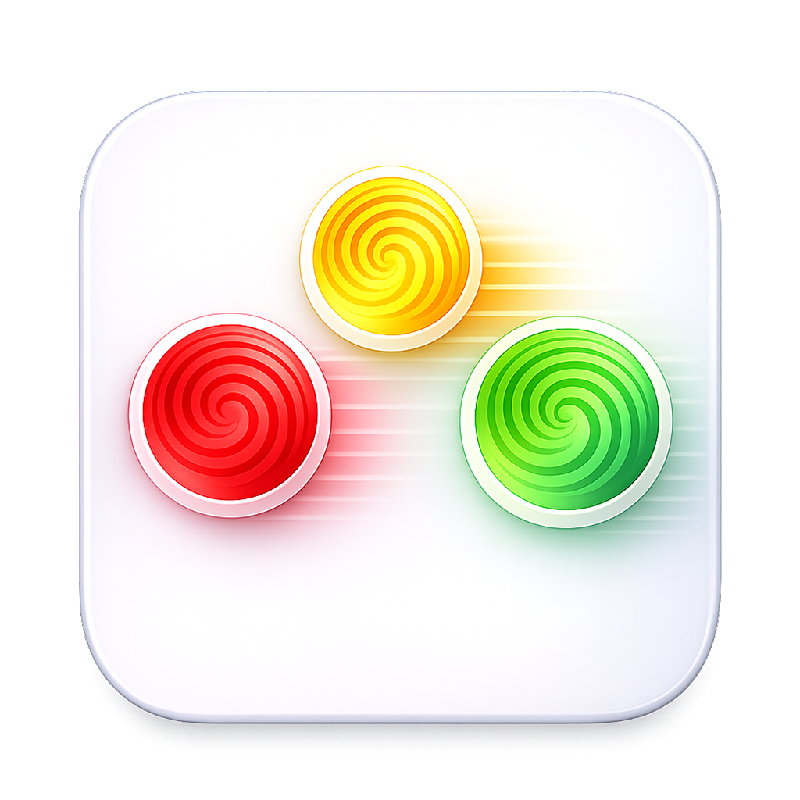

<p align="center">
  
</p>

<h1 align="center">FlowTouch</h1>

<p align="center">
  <b>手势驱动的 macOS 效率工具</b><br>
  将触控板变成强大的指令中心 —— 滑动、点击或捏合，即可掌控窗口、应用、媒体等一切操作。
</p>

<p align="center">
  <a href="README.md">🇺🇸 English</a>
</p>

---

## ✨ 核心亮点

| | |
|---|---|
| 🖐️ **丰富的多指手势** | 滑动（2–5 指）、点击（单击 / 双击 / 三击）、捏合 / 张开 |
| 🪟 **50+ 内置指令** | 窗口贴靠、媒体控制、截图、空间导航、自定义快捷键等 |
| 🎯 **应用级规则** | 同一手势可按当前 App 执行不同操作 |
| 🧪 **学习模式** | 只显示手势识别结果，不执行动作 —— 非常适合新手熟悉手势 |
| 🔄 **撤销支持** | 一键还原上次窗口操作 |
| 💡 **视觉反馈 HUD** | 屏幕叠层实时确认每次操作 |

---

## 🚀 快速开始

### 系统要求

- **macOS**（原生应用，不需要模拟器）
- 触控板 —— Magic Trackpad 或 MacBook 内置触控板

### 安装

1. 从 [Releases](https://github.com/appally/FlowTouch/releases) 下载最新版本。
2. 将 **FlowTouch.app** 拖入 `/Applications` 文件夹。
3. 启动应用并授予所需权限（见下方说明）。

### 权限说明

FlowTouch 需要两项系统权限才能正常工作：

| 权限 | 用途 |
|---|---|
| **输入监控** | 捕获触控板的原始多点触控数据 |
| **辅助功能** | 移动和调整窗口大小、模拟按键事件 |

> **提示：** 在 Xcode 中重新编译可能导致权限失效。如果手势不再响应，请前往  
> `系统设置 → 隐私与安全性`，移除后重新添加 FlowTouch。

---

## 🎮 支持的操作

<table>
<tr><th>分类</th><th>操作</th></tr>
<tr><td>🪟 窗口布局</td><td>左 / 右 / 上 / 下半屏，四角贴靠</td></tr>
<tr><td>🔲 窗口控制</td><td>最大化、最小化、居中、还原、关闭、全屏、撤销、垂直/水平最大化、全部最小化、恢复全部</td></tr>
<tr><td>🖥️ 屏幕与空间</td><td>移至下/上个屏幕，切换左/右空间</td></tr>
<tr><td>🏠 桌面与系统</td><td>调度中心、显示桌面、应用窗口、启动台、聚焦搜索、锁定屏幕、屏幕保护</td></tr>
<tr><td>📱 应用控制</td><td>退出、隐藏、隐藏其他、切换应用、上个应用</td></tr>
<tr><td>🗂️ 标签页</td><td>新建、关闭、下一个 / 上一个标签页</td></tr>
<tr><td>🎵 媒体</td><td>播放/暂停、上/下一曲、音量增减/静音、亮度增减</td></tr>
<tr><td>📸 截图</td><td>截取全屏 / 区域 / 窗口</td></tr>
<tr><td>⌨️ 自定义快捷键</td><td>触发你自定义的任意键盘快捷键</td></tr>
</table>

---

## 🛠️ 从源码构建

```bash
# 克隆仓库
git clone https://github.com/appally/FlowTouch.git
cd FlowTouch

# 在 Xcode 中打开
open FlowTouch.xcodeproj
# 按 ⌘R 运行
```

**命令行构建：**

```bash
# Debug 构建
xcodebuild -project FlowTouch.xcodeproj -scheme FlowTouch -configuration Debug build

# Release 构建
xcodebuild -project FlowTouch.xcodeproj -scheme FlowTouch -configuration Release build
```

---

## 🤝 贡献指南

| 主题 | 规范 |
|---|---|
| **代码风格** | 标准 Swift —— 4 空格缩进、`// MARK:` 分区、文件名与主类型一致 |
| **命名约定** | 类型用 `UpperCamelCase`，方法和属性用 `lowerCamelCase` |
| **提交信息** | 遵循 Conventional Commits（`feat:`、`fix:` 等），中文消息完全可以 |
| **Pull Request** | 请包含变更摘要、测试步骤，UI 改动需附截图 |

---

## 📄 许可证

详情请参阅 [LICENSE](LICENSE)。
